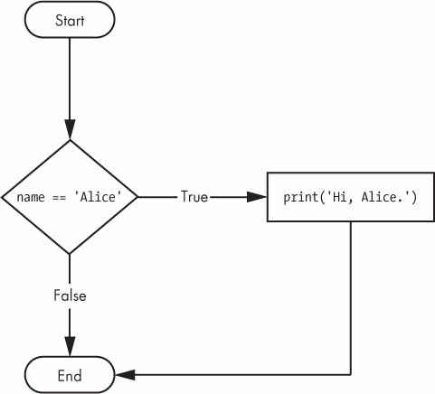
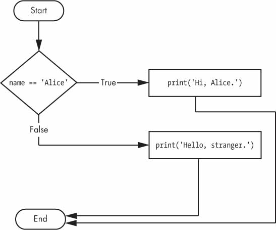
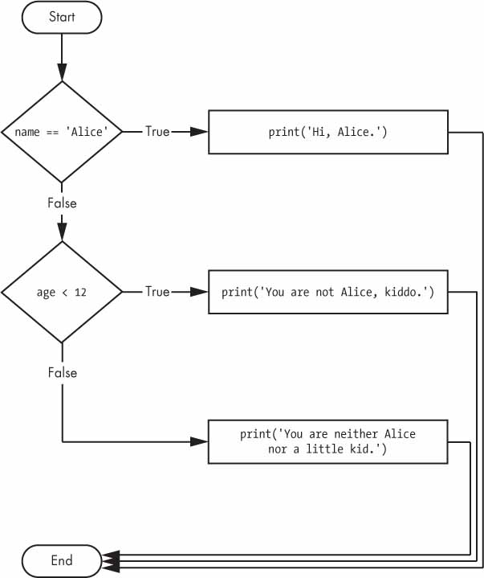
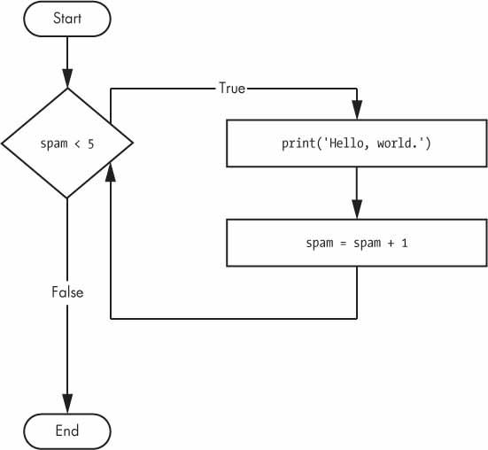
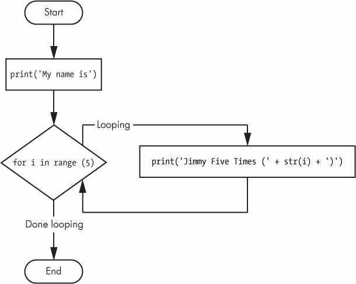

# Automate the Boring Stuff
Book used as a proxy for a beginner course. Learnings based on 2nd edition of the book.

## 0. What is programming?
Simply the act of entering instructions for the computer to perform. Programs use basic instructions 
as building blocks. Building blocks can be combined to implement more intricate decisions

## 1. Python Basics

### 1.1 Expressions
In Python, the most basic kind of programming instruction is called an *expression* (e.g 2+2). Expressions consist of 
values (2) and operators (+), which always evaluate (i.e. reduce) down to a single value. Therefore you can 
use expressions anywhere in Python code that you could also use a value. A single value with no operators is also 
considered an expression, though it evaluates only to itself. There are many other math operators in python, such as:

*Table 1: Math operators in Python*

| Operator | Operation         | Example | Evaluation |
|----------|-------------------|---------|------------|
| **       | Exponent          | 2 ** 3  | 8          |
| %        | Modulus/remainder | 22 % 8  | 6          |
| //       | Integer division  | 22 // 8 | 2          |
| /        | Division          | 22 / 8  | 2.75       |
| *        | Multiplication    | 3 * 5   | 15         |
| -        | Subtraction       | 5 - 2   | 3          |
| +        | Addition          | 2 + 2   | 4          |

The order of operations (precedence) follows mathematics. You can use parentheses to override the usual precedence if 
you need to. Whitespace in between the operators and values doesn’t matter for Python (except for the indentation at the
beginning of the line), but a single space is convention. The rules for putting operators and values together to form 
expressions are a fundamental part of Python as a programming language, just like the grammar rules that help us 
communicate.

### 1.2 Data Types
A data type is a category for values, and every value belongs to exactly one data type. The most common data types in 
Python are:
- Integer (or int) data type indicates values that are whole numbers
- Floating-point numbers (or floats) are numbers with a decimal point
- Strings (or strs) are text values. Surround your string in single quote (') characters so Python knows where the 
string begins and ends

NB: The meaning of an operator may change based on the data types of the values next to it, e.g. a "+" operator will add
int values together but concatenate strings

### 1.3 Variables
A variable is like a box in the computer’s memory where you can store values. If you want to use the result of 
an evaluated expression later in your program, you can save it inside a variable using an *assignment statement*. An 
assignment statement consists of a variable name, an equal sign (called the *assignment operator*), and the expression.
An example is assigning the number of days as 30, e.g. `days = 30`.

A variable is initialized (created) the first time a value is stored in it. After that, you can use it in expressions 
with other variables and values. When a variable is assigned a new value, the old value is forgotten and variable 
overwritten.

A good variable name describes the data it contains (e.g. labelling a box "stuff" when moving may not be as helpful as 
"pots"). Variable names are case-sensitive so `Name` and `name` are different variables. You can name a variable 
anything as long as it obeys the following three rules:
- Can be only one word with no spaces
- Use only letters, numbers, and the underscore (_) character
- Can’t begin with a number

## 2. Flow Control

### 2.1 Intro
A program is a series of instructions or expressions, but programming’s real strength isn’t just running one instruction after another 
like a weekend errand list. Based on how expressions evaluate, a program can decide to skip instructions, repeat them, 
or choose one of several instructions to run. Flow control statements can decide which Python instructions to execute 
under which conditions. This can best be observed as a flow chart where each shape and arrow indicates some thought 
process.

*Fig 1: What to do when it is raining?*


In a flowchart, there is usually more than one way to go from the start to the end. Flowcharts represent these branching
points with diamonds, while the other steps are represented with rectangles. The starting and ending steps are 
represented with rounded rectangles. Similar ideas can be implemented in code and an important building block to explore
is Boolean operators.

### 2.2 Boolean Operators
The Boolean data type has only two values `True` and `False`. It is used in expressions and can be stored in variables.
*Comparison Operators* compare two values (or expressions) and evaluate down to a single Boolean value (i.e. True or 
False).

*Table 2: Comparison Operators in Python*

| Operator | Meaning                  |
|----------|--------------------------|
| ==       | Equal to                 |
| !=       | Not equal to             |
| <        | Less than                |
| \>       | Greater than             |
| <=       | Less than or equal to    |
| \>=      | Greater than or equal to |

There are also 3 *Boolean Operators* in Python (*and*, *or* and *not*) which also evaluate expressions down to a Boolean
value. The *and* and *or* operators always take 2 values/expressions and return a Boolean values based on the following
logic.

*Table 3: Truth table for Boolean Operators*

| Expression      | *and* Evaluation | *or* Evaluation |
|-----------------|------------------|-----------------|
| True and True   | True             | True            | 
| True and False  | False            | True            |
| False and True  | False            | True            |
| False and False | False            | False           |

The *not* operator pairs with a single Boolean value and will evaluate to the opposite of the Boolean value.

Boolean Operators and Comparison Operators can be used together and multiple operators can be used in the same 
expression. An order of precedence also exists for these operators with *not* occurring first.

### 2.3 Elements of Flow Control
Flow control statements often start with a part called the *condition* (an expression that evaluates to a Boolean value)
and are always followed by a block (multiple lines) of code called the *clause*. You can tell when a block begins and 
ends from the indentation of the lines of code. There are three rules for blocks:
- Blocks begin when the indentation increases
- Blocks can contain other blocks
- Blocks end when the indentation decreases to zero or to a containing block’s indentation

#### 2.3.1 Conditional Statements

##### 2.3.1.1 `if` Statement
The most common type of flow control statement is the *if statement*. An if statement’s clause (that is, the block 
following the if statement) will execute if the statement’s condition is True. The clause is skipped if the condition 
is False. In simple terms, “If this condition is true, execute the code in the clause.” In Python, an if statement 
consists of the following:
- The `if` keyword
- A condition (that is, an expression that evaluates to True or False)
- A colon 
- Starting on the next line, an indented block of code (called the *if clause*)

*Fig 2: Flowchart of an if statement*



The pythonic way of writing the logic shown in the flowchart would be as follows
```
if(name == 'Alice'):
    print('Hi, Alice.')
```

##### 2.3.1.2 `else` Statement
An if clause can optionally be followed by an else statement. The else clause is executed only when the if statement’s
condition is False. In simple terms, “If this condition is true, execute this code. Or else, execute that code.” An else
statement doesn’t have a condition, and in code, an else statement always consists of the following:
- The `else` keyword
- A colon 
- Starting on the next line, an indented block of code (called the *else clause*)

*Fig 3: Flowchart of an else statement*



The example builds on the if statement and can be written as
```
if(name == 'Alice'):
    print('Hi, Alice.')
else:
    print('Hello, stranger.')
```

##### 2.3.1.3 `elif` Statement
You may have a case where you want one of many possible clauses to execute. The elif statement is an “else if” statement
that always follows an if or another elif statement. It provides another condition that is checked only if all of the
previous conditions were False (so order of statements is important). In code, an elif statement always consists of:
- The `elif` keyword 
- A condition
- A colon 
- Starting on the next line, an indented block of code (called the *elif clause*)

*Fig 4: Flowchart of an elif statement*



The example builds on the previous examples and can be written as
```
if(name == 'Alice'):
    print('Hi, Alice.')
elif (age < 12):
    print('You are not Alice, kiddo.')
else:
    print('You are neither Alice nor a little kid.')
```

##### 2.3.1.4 `while` Loop Statement
You can make a block of code execute over and over again using a while statement. The code in a while clause will be
executed as long as the while statement’s condition is True. In code, a while statement always consists of:
- The `while` keyword 
- A condition 
- A colon 
- Starting on the next line, an indented block of code (called the *while clause*)

You can see that a while statement looks similar to an if statement. The difference is in how they behave. At the end of
an if clause, the program execution continues after the if statement. But at the end of a while clause, the program
execution jumps back to the start of the while statement. The while clause is often called the while loop.

*Fig 5: Flowchart of a while statement*



The pythonic way of writing the logic shown in the flowchart would be as follows
```
spam = 0
while spam < 5:
    print('Hello, world.')
    spam = spam + 1
```

A `break` or `continue` statement can also be included in the while clause and alters the flow of the loop. When the 
code reaches the `break` statement it immediately exits the while loop’s clause. In contrast, when the code reaches a
continue statement the program execution immediately jumps back to the start of the loop and reevaluates the loop’s
condition.

##### 2.3.1.5 `for` Loop Statement
A for loop statement will execute a block of code a certain number of times as opposed to a while loop which continues
while the condition is met. A for loop includes:
- The `for` keyword 
- A variable name 
- The `in` keyword 
- A call to the range() method with up to three integers passed to it
- A colon

*Fig 5: Flowchart of a for statement*



The pythonic way of writing the logic shown in the flowchart would be as follows
```
print('My name is')
for i in range(5):
    print('Jimmy Five Times (' + str(i) + ')')
```

## 3. Functions

A function is a block of organized, reusable code that is performed when the function is called. Functions are useful as
they allow for deduplication of code. Often, functions will take in an input (or argument) and return an output. A 
function consists of:
- The `def` keyword 
- A function name 
- Arguments of the function 
- A colon
- A block of code (which may include the `return` keyword)

An example of a function is as follows:
```
def exponentiation(base, power):
    result = base^power
    return result
    
exponentiation(3, 2)
>> 9
```

The example above shows a function can be called whenever we need to do exponent calculations. The
function itself includes the parameters `base` and `power`, with the function returning the evaluated exponent
calculation. When the function is called we provide the arguments that we require (`3` for base and `2` power) and these
values take the place of the parameter in the calculation.

Another concept to consider is the idea of `global` and `local` scope of variables. The `result` variable in the example
above is in the function and considered a local scope variable. This means that the variable does not exist outside the 
function (or, in other words, the global scope). Variables in local scope cannot be used in the global scope or in other
local scopes. The variable wil need to be defined outside the function to be considered a global scope variable or the
`global` keyword can be used before the variable to highlight its scope. Global scope variables can be called in local
scopes such as functions.

A useful technique to consider when creating a function is exception handling. Exceptions occur when there are logical
errors and this will show in the terminal. An example of this is the ZeroDivisionError which occurs when there is
division by zero. These errors can be handled with `try` and `except` clauses which allows the code to execute. Example:

```
def division(number, quotient):
    try:
        return number / quotient
    except ZeroDivisionError:
        print('Error: Invalid argument.')
```

## 4. Lists

### 4.1 Defining a List
A list is a data type that contains multiple values in an ordered sequence. The term *list value* refers to the list
itself (which can be stored in a variable or passed to a function). As an example, a list value `animal` contains: 
['cat', 'bat', 'rat', 'elephant']. A list begins with an opening square bracket and ends with a closing square bracket,
[]. Values inside the list are also called items. Items are separated with commas (that is, they are comma-delimited).

Lists are not the only datatype that is part of the larger sequence data type and a lot of the techniques discussed
below are shared by data types such as tuples (which uses `()` instead of `[]`). Another key point to mention is that a
list is mutable (it can be changed) and changes to the list will not change the identity of the variable on the PC (if
you are interested look into the `id()` function) while changes to an immutable data type variable like a string or
tuple will result in a new variable even if the same name is used.

### 4.2 Indexing
The contents of a list value can be found using *indexing*. This is achieved by calling the list value and the index
(position specified by an Integer) of the item you wish to see. It is important to note that zero-indexing is used so
the position number will start at 0. As an example, `animal[2]` would be `rat`. Python will call an exception if the index
is out of the list range. A *negative index* can also be used which will count towards the left of the list value
instead of the right, i.e. `animal[-1]` would be `elephant`. Another useful feature when using indices is a *slice*. A
slice has a start and end number, which will create a new list consisting of the elements from the start number up to
(but not including) the end number. So `animal[1:3]` would result in `['bat', 'rat']`.

An item in a list can be changed by calling its index position and reassigning the variable. `animal[-1] = 'cow'` will
change `animal` to ['cat', 'bat', 'rat', 'cow'].

### 4.3 List Operations
- List items can be removed using a `del`statement followed by the item position
- The `+` operator when used with lists will result in concatenation of the lists (similar to the string datatype)
- The length of a list can be evaluated by wrapping a len() around the list
- The `in` operator can be used to evaluate if an item is in a list value and will return a Boolean datatype
- Can replace the `range()` condition mentioned in Section 2.3.1.5 (`for` loops), allowing for loops on string values
- The `enumerate()` function used in a `for` loop will unpack a list into both it's item value and index position

### 4.4 List Methods
A method is similar to a function except that it is called on a variable (value or datatype). Methods are built into
datatypes and other packages, so it is helpful to read documentation to understand what methods are available. A method
is called with a `.method_name` straight after the variable name and will sometimes have () to allow for parameters. A 
method will interact with the variable as an object and any changes will not need to be declared, e.g.
`list.append('new item)` instead of`list = list + 'new item'`. The reason for this lies in a topic called Object
Oriented Programming (or Classes) and is out of scope for this book. Some of the methods that can be applied to lists:
- Can find the index value of an item using index(*item name*), i.e. `animal.index('rat')` will evaluate to 2
- append(*item name*) or insert(*index position*, *item name*) can be used to add new values to the list
- remove(*item name*) can be used to delete an item from a list, beneficial to `del` when index position is not known
- Items can be sorted in a list using sort(), this will sort either numerically or alphabetically based on data
  - The sort order can be changed using `sort(reverse=True)`
- The list order can be flipped around using reverse() which will swap the first and last elements and so on

## 5. Dictionary

### 5.1 Defining a Dictionary
A dictionary is similar to a list in that is a mutable collection of many values. The difference between the datatypes
lies in how indexing is treated. A list uses the numerical position of the item as the index, while a dictionary uses a
key-value pair approach to indexing. The latter approach allows a dictionary to use string values as the index for
items. A dictionary is defined using `{}` brackets, while a colon specifies key-value pairs and a comma indicates a new
item. For example, `my_cat = {'size': 'fat', 'color': 'gray', 'disposition': 'loud'}` and `my_cat['size'] == 'fat'`.
The value in a dictionary can be a nested list or dictionary.

### 5.2 Dictionary Methods
There are three dictionary methods that will return list-like values of the dictionary’s keys, values, or both keys and
values: keys(), values(), and items(). The values returned by these methods are not true lists: they cannot be modified
and do not have an append() method. But these data types (dict_keys, dict_values, and dict_items, respectively) can be
used in for loops.

The `setdefault(key, value_if_no_key)` method can be used if we are not sure that a key exists in the dictionary. The
method will search for the key and if it does not exist then it will create a key-value pair based on the arguments.

## 6. Strings

### 6.1 String Fundamentals
Text format that is required to be typed in single or double quotation marks. An escape character `\` can be used for text
which may be confused with special characters in Python. Using an `r` before the quotation marks of the string will
ignore any escape characters in the string (useful for Windows filepaths).

*Table 4: String Escape Character Operations*

| Escape character | Prints as                  |
|------------------|----------------------------|
| \\'               | Single quote               |
| \\"               | Double quote               |
| \t               | Tab                        |
| \n               | Newline (line break)       |
| \\\              | Backslash                  |

Triple quotes `""" text """` or `''' text '''` is used for multi-line text. Quotes, tabs and newlines can be used in the triple
quotes and will be considered part of the string. Triple quotes are an effective method of writing multi-line comments.

Using `[]` brackets acts as an index for string variables. This will split the string into characters which can be accessed
using the correct index value. Slices of strings can also be performed using `[start position:end position+1]`. Slicing
does not modify the original string!

`in` and `not in` operators can be used to check if a character or substring is present in the string.

### 6.2 String Methods
The string datatype has built-in methods which are quite useful. `.upper()` and `.lower()` will convert the string into the
appropriate case. These methods do not replace the original string unless declared. There are also a series of `isX()`
methods which can be used to determine if strings are only uppercase, lowercase, letters, spaces, etc.

The `startswith()` and `endswith()` methods can be used to determine if string begins or ends with the substring. The `.join()`
method can be used to concatenate multiple strings together, while `.split()` will split the text by whitespace into a list.
Including substring in the split method, i.e. `.split(",")` will split the text by the substring instead of whitespace

Whitespace can be removed from string using `.strip()`, `.lstrip()` or `.rstrip()`. The operators are useful for removing
trailing whitespace.

The `ord('character')` function will convert a character into the unicode code point which is useful when sorting characters.
Similarly, the `chr(number)` will convert a unicode code point into the character.

## 7. Regular Expressions

## 8. Working with Time Format

## 9. Manipulating Files (Section 9 and 10)

## 10. Intro to Web-scraping

## 11. Working with Excel Files

## 12. Working with Google Sheets

## 13. Working with PDFs and Word Documents

## 14. Scheduling Tasks and Launching Programs

## 15. Sending Emails and Texts

## 16. Manipulating Images

## 17. GUI Automation

## 18. Other Useful Concepts from the Course

- Input validation ensures data integrity is intact. Some packages (e.g. pyinputplus from section 8) have built-in functions
to assist with this
- There are numerous tools to debug such as raising exceptions, using assertions, breakpoints and logging. Using logging is
preferred over print() statements as logging can be deactivated with one command

